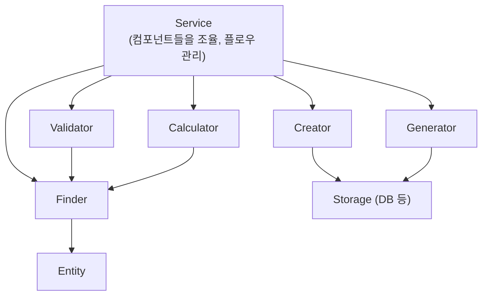
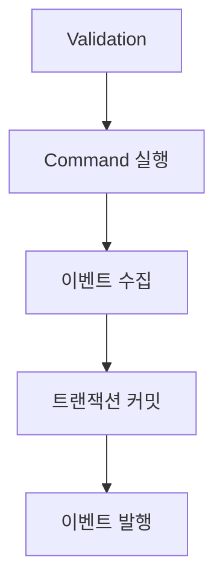

# 프로젝트 아키텍처 가이드라인

## 레이어 구조

```
Controller → Service → Components → Entity
```

- **Controller**: HTTP 요청/응답 처리, DTO 변환
- **Service**: 비즈니스 로직 조율, 트랜잭션 경계 관리
- **Components**: 단일 책임의 세분화된 컴포넌트
- **Entity**: 도메인 모델, 비즈니스 규칙 캡슐화

---

## 의존성 원칙

### 핵심 규칙: Service는 다른 Service를 의존하지 않는다

```
[Good] 허용되는 의존
Controller → Service
Service → Component
Service → Entity
Component → Component (같은 모듈 내)
Component → Entity

[Bad] 금지되는 의존
Service → Service
```

### 이 원칙을 따르는 이유

| 이유                     | 설명                                          |
| ------------------------ | --------------------------------------------- |
| **순환 의존 방지**       | Service 간 상호 참조 원천 차단                |
| **트랜잭션 경계 명확화** | 중첩 트랜잭션으로 인한 예상치 못한 동작 방지  |
| **모듈 경계 강화**       | 모듈 간 결합도 감소, 마이크로서비스 전환 용이 |
| **테스트 용이성**        | 모킹 대상이 Component로 한정                  |
| **책임 명확화**          | Service는 조율만, 재사용 로직은 Component     |

### 다른 모듈의 기능이 필요한 경우

```typescript
// [Bad] Service → Service
@Injectable()
export class OrderService {
  constructor(
    private readonly userService: UserService, // 금지
  ) {}
}

// [Good] Service → Component
@Injectable()
export class OrderService {
  constructor(
    private readonly userFinder: UserFinder, // Component 사용
  ) {}
}
```

### 모듈 Export 규칙

```typescript
// user.module.ts
@Module({
  providers: [UserService, UserFinder, UserCreator, UserCreationValidator],
  exports: [UserFinder, UserCreator], // Component만 export, Service는 export 안 함
})
export class UserModule {}
```

### 참고: Nest.js 공식 docs와의 차이

NestJS 생태계에서는 Service → Service를 허용하는 경우가 많지만, 이 프로젝트는 모듈 간 결합도를 낮추고 장기 유지보수성을 위해 더 엄격한 규칙을 적용합니다.

### 컴포넌트 간 의존 관계

컴포넌트끼리의 의존은 **허용되지만, 규칙이 존재함**

#### [Good] 허용되는 컴포넌트 간 의존

| 의존 방향                      | 이유                     | 예시                                                       |
| ------------------------------ | ------------------------ | ---------------------------------------------------------- |
| **Query → Query**              | 부작용 없음, 안전        | `OrderFinder → UserFinder`                                 |
| **Validator → Query**          | 검증을 위해 조회 필수    | `UserCreationValidator → UserFinder`                       |
| **Calculator → Query**         | 계산에 필요한 데이터조회 | `PriceCalculator → CouponFinder`                           |
| **Generator → Storage**        | 생성 후 저장 필요        | `TokenGenerator → AuthTokenStorage`                        |
| **Command → Query** (주의필요) | 생성/수정 전 조회        | `OrderCreator → ProductFinder` (가능하면 Service에서 조율) |

#### [Bad] 피해야 하는 컴포넌트 간 의존

| 의존 방향             | 문제점                   | 대안                  |
| --------------------- | ------------------------ | --------------------- |
| **Command → Command** | 트랜잭션 경계 모호       | Service에서 순차 호출 |
| **Creator → Creator** | 책임 혼재, 트랜잭션 중첩 | Service에서 조율      |
| **순환 의존**         | A → B → A 형태           | 설계 재검토           |
| **3단계 이상 체인**   | A → B → C → D            | 중간 레이어 제거 검토 |

#### 의존 관계 다이어그램



#### 판단 기준

| 기준                    | 가이드                    |
| ----------------------- | ------------------------- |
| **Query → Query**       | 허용                      |
| **Validator → Query**   | 허용                      |
| **Calculator → Query**  | 허용                      |
| **Generator → Storage** | 허용                      |
| **Command → Query**     | 가능하면 Service에서 조율 |
| **Command → Command**   | 피하기 (Service에서 조율) |
| **순환 의존**           | 절대 금지                 |
| **3단계 이상 체인**     | 설계 재검토               |

#### 테스트 관점

컴포넌트 간 의존이 있으면 테스트 시 모킹 체인이 발생합니다:

```typescript
// UserCreationValidator 테스트
describe('UserCreationValidator', () => {
  let validator: UserCreationValidator;
  let userFinder: jest.Mocked<UserFinder>; // 모킹 필요

  beforeEach(() => {
    userFinder = { findByEmail: jest.fn() } as any;
    validator = new UserCreationValidator(userFinder);
  });
});
```

1~2단계 의존은 괜찮지만, 3단계 이상 깊어지면 테스트 셋업이 복잡해지므로 **설계를 재검토**해야 합니다.

---

## 컴포넌트 분류 체계

### Query 계열 (읽기 전용, 상태 변경 없음)

| 유형        | 책임                  | 네이밍 예시                                           |
| ----------- | --------------------- | ----------------------------------------------------- |
| **Finder**  | 단일/다중 엔티티 조회 | `UserFinder.findById()`, `OrderFinder.findByUserId()` |
| **Reader**  | 복잡한 조회/집계      | `DashboardReader.readStatistics()`                    |
| **Checker** | 존재 여부/조건 확인   | `OrderChecker.canCancel()`, `UserChecker.exists()`    |

### Command 계열 (상태 변경)

| 유형         | 책임           | 네이밍 예시                                                  |
| ------------ | -------------- | ------------------------------------------------------------ |
| **Creator**  | 엔티티 생성    | `UserCreator.create()`, `OrderCreator.create()`              |
| **Updater**  | 엔티티 수정    | `UserUpdater.updateProfile()`, `OrderUpdater.updateStatus()` |
| **Remover**  | 엔티티 삭제    | `UserRemover.softDelete()`, `OrderRemover.cancel()`          |
| **Executor** | 복합 명령 실행 | `PaymentExecutor.execute()`                                  |

### 기타 컴포넌트

| 유형           | 책임                              | 네이밍 예시                          |
| -------------- | --------------------------------- | ------------------------------------ |
| **Validator**  | 비즈니스 규칙 검증, 예외 발생     | `UserCreationValidator.validate()`   |
| **Converter**  | DTO ↔ Entity 변환, 형식 변환     | `UserConverter.toResponse()`         |
| **Calculator** | 복잡한 계산 로직                  | `OrderPriceCalculator.calculate()`   |
| **Generator**  | 토큰, ID, 코드 생성               | `TokenGenerator.generate()`          |
| **Storage**    | 외부 저장소 추상화 (Redis, S3 등) | `AuthTokenStorage.save()`            |
| **Notifier**   | 이벤트 발행, 알림 전송            | `OrderEventNotifier.notifyCreated()` |
| **Enricher**   | 데이터 보강/조합                  | `UserEnricher.withProfile()`         |
| **Policy**     | 정책/규칙 판단                    | `RefundPolicy.canRefund()`           |

---

## 컴포넌트 분리 기준

### 분리해야 하는 경우

1. **재사용성이 높은 경우**
   - 여러 Service에서 동일한 조회/생성 로직이 필요할 때
   - 예: `UserFinder`는 `AuthService`, `UserService` 등에서 공통 사용

2. **복잡한 쿼리 로직이 있는 경우**
   - 단순 `findOne`이 아닌 조건부 쿼리, 조인, 서브쿼리 등
   - QueryBuilder 사용이 필요한 경우

3. **트랜잭션 경계가 명확한 Command인 경우**
   - `@Transactional()` 데코레이터가 필요한 생성/수정/삭제 로직

4. **테스트 격리가 필요한 경우**
   - 단위 테스트를 위해 모킹이 필요한 복잡한 로직

### Service에서 직접 Repository 사용해도 되는 경우

1. **해당 모듈에서만 사용되는 단순 CRUD**
2. **다른 모듈에서 참조할 일이 없는 경우**
3. **쿼리가 단순하고 비즈니스 로직이 거의 없는 경우**

### 분리 결정 플로우차트

```shell
로직을 분리해야 하는가?
│
├── Repository/DB 접근이 필요한가?
│   ├── Yes → 재사용 가능성이 있는가?
│   │         ├── Yes → Component 로 분리
│   │         └── No  → 복잡한 로직인가?
│   │                   ├── Yes → Component 로 분리 (테스트 용이성)
│   │                   └── No  → Service에서 직접 Repository 사용 OK
│   └── No  → 아래 계속
│
└── 어떤 종류의 로직인가?
    ├── 비즈니스 규칙 검증 → Validator
    ├── DTO ↔ Entity 변환 → Converter
    ├── 복잡한 계산 → Calculator
    ├── 토큰/ID 생성 → Generator
    └── 외부 시스템 연동 → Storage/Client
```

### 실용적 기준

- **3회 이상 사용** → 무조건 분리
- **테스트하기 어려움** → 분리하여 격리
- **책임이 명확히 다름** → 분리 (SRP)
- **외부 의존성** → 추상화 레이어로 분리

---

## 디렉토리 구조 예시

```
src/
└── user/
    ├── controllers/
    │   └── user.v1.controller.ts
    ├── services/
    │   └── user.service.ts
    ├── components/
    │   ├── query/
    │   │   ├── user.finder.ts
    │   │   └── user.reader.ts
    │   ├── command/
    │   │   ├── user.creator.ts
    │   │   └── user.updater.ts
    │   ├── validator/
    │   │   └── user-creation.validator.ts
    │   └── converter/
    │       └── user.converter.ts
    ├── entities/
    │   └── user.entity.ts
    ├── dto/
    │   ├── create-user.dto.ts
    │   └── user-response.dto.ts
    └── user.module.ts
```

> 컴포넌트가 적을 경우 `components/` 하위에 플랫하게 배치해도 무방합니다.

---

## 코드 예시

### Finder (Query)

```typescript
@Injectable()
export class UserFinder {
  constructor(
    @InjectRepository(User)
    private readonly userRepository: EntityRepository<User>,
  ) {}

  async findById(id: number): Promise<User | null> {
    return await this.userRepository.findOne({ id });
  }

  async findByEmail(email: string): Promise<User | null> {
    return await this.userRepository
      .createQueryBuilder('u')
      .where({ email })
      .getSingleResult();
  }
}
```

### Creator (Command)

```typescript
@Injectable()
export class UserCreator {
  constructor(
    @InjectRepository(User)
    private readonly userRepository: EntityRepository<User>,
  ) {}

  @Transactional()
  async create(dto: CreateUserDto): Promise<User> {
    const newUser = User.of({
      email: dto.email,
      password: dto.password,
      nickname: dto.nickname,
    });

    this.userRepository.getEntityManager().persist(newUser);

    return newUser;
  }
}
```

### Validator

```typescript
@Injectable()
export class UserCreationValidator {
  constructor(private readonly userFinder: UserFinder) {}

  async validate(args: { email: string }): Promise<void> {
    const existingUser = await this.userFinder.findByEmail(args.email);

    if (existingUser) {
      throw new ConflictException('이미 존재하는 이메일입니다.');
    }
  }
}
```

### Converter

```typescript
@Injectable()
export class UserConverter {
  toResponse(user: User): UserResponseDto {
    return {
      id: user.id,
      email: user.email,
      nickname: user.nickname,
      createdAt: user.createdAt,
    };
  }

  toListResponse(users: User[]): UserListResponseDto {
    return {
      items: users.map((u) => this.toResponse(u)),
      total: users.length,
    };
  }
}
```

### Calculator

```typescript
@Injectable()
export class OrderPriceCalculator {
  calculate(items: OrderItem[], coupons: Coupon[]): PriceResult {
    const subtotal = items.reduce(
      (sum, item) => sum + item.price * item.quantity,
      0,
    );
    const discount = this.calculateDiscount(subtotal, coupons);
    const tax = (subtotal - discount) * 0.1;

    return {
      subtotal,
      discount,
      tax,
      total: subtotal - discount + tax,
    };
  }

  private calculateDiscount(subtotal: number, coupons: Coupon[]): number {
    // 할인 계산 로직
  }
}
```

### Service (컴포넌트 조율)

```typescript
@Injectable()
export class UserService {
  constructor(
    private readonly userFinder: UserFinder,
    private readonly userCreator: UserCreator,
    private readonly userCreationValidator: UserCreationValidator,
    private readonly userConverter: UserConverter,
  ) {}

  async create(dto: CreateUserDto): Promise<UserResponseDto> {
    await this.userCreationValidator.validate({ email: dto.email });
    const user = await this.userCreator.create(dto);
    return this.userConverter.toResponse(user);
  }

  async findOne(id: number): Promise<UserResponseDto> {
    const user = await this.userFinder.findById(id);

    if (!user || !user.isActive()) {
      throw new NotFoundException('사용자를 찾을 수 없습니다.');
    }

    return this.userConverter.toResponse(user);
  }
}
```

---

## Entity 설계 원칙 (Rich Domain Model)

Entity는 단순 데이터 컨테이너가 아닌, **도메인 로직을 캡슐화하는 객체**입니다.

### Entity가 가져야 할 것

| 유형                     | 설명                           | 예시                                |
| ------------------------ | ------------------------------ | ----------------------------------- |
| **정적 팩토리 메서드**   | 엔티티 생성 로직 캡슐화        | `User.of({ email, password, ... })` |
| **상태 조회 메서드**     | 엔티티 상태 확인               | `isActive()`, `isExpired()`         |
| **상태 변경 메서드**     | 비즈니스 규칙에 따른 상태 변경 | `delete()`, `changePassword()`      |
| **계산된 속성 (getter)** | 파생 데이터 제공               | `get termsAgreed(): boolean`        |
| **자기 데이터 검증**     | 엔티티 내부 데이터 기반 검증   | `verifyPassword(plain)`             |

### Entity가 가지면 안 되는 것

| 유형                     | 이유                   | 대안                    |
| ------------------------ | ---------------------- | ----------------------- |
| **외부 서비스 의존**     | DI 불가, 테스트 어려움 | Component로 분리        |
| **다른 엔티티 조회**     | Repository 의존 필요   | Finder/Reader로 분리    |
| **외부 API 호출**        | 인프라 레이어 의존     | Client/Storage로 분리   |
| **복잡한 비즈니스 로직** | 엔티티 비대화          | Service/Executor로 분리 |

### 코드 예시

```typescript
@Entity()
export class User {
  @PrimaryKey()
  id: number;

  @Property({ type: 'text', unique: true })
  email: string;

  @Property({ type: 'text' })
  password: string;

  @Property({ nullable: true, type: 'timestamp with time zone' })
  deletedAt: Date | null = null;

  // [Good] 정적 팩토리 메서드: 생성 로직 캡슐화
  static of(args: CreateUserArgs): User {
    const user = new User();
    user.email = args.email;
    user.hashPassword(args.password);
    user.nickname = args.nickname;
    return user;
  }

  // [Good] 계산된 속성: 파생 데이터
  get termsAgreed(): boolean {
    return this.termsAgreedAt !== null;
  }

  // [Good] 상태 조회: 엔티티 상태 확인
  isActive(): boolean {
    return this.deletedAt === null;
  }

  // [Good] 상태 변경: 비즈니스 규칙 적용
  delete(): void {
    this.deletedAt = new Date();
  }

  // [Good] 자기 데이터 검증: 외부 의존 없음
  verifyPassword(plainPassword: string): boolean {
    return bcrypt.compareSync(plainPassword, this.password);
  }

  // [Good] 내부 헬퍼: private 또는 내부용
  hashPassword(plainPassword: string): void {
    const salt = bcrypt.genSaltSync(10);
    this.password = bcrypt.hashSync(plainPassword, salt);
  }

  // [Bad] 외부 서비스 의존
  // async sendWelcomeEmail() {
  //   await this.emailService.send(...); // DI 불가능
  // }
}
```

### Rich Domain Model 사용 시 주의사항

#### [Bad] 원자적 연산이 필요한 로직

동시성 이슈가 발생할 수 있는 연산은 Entity 메서드로 구현하면 안 됩니다.

```typescript
// [Bad] 동시성 이슈 발생 가능
@Entity()
export class Product {
  @Property()
  stock: number;

  // 두 요청이 동시에 실행되면 race condition 발생
  decreaseStock(quantity: number): void {
    if (this.stock < quantity) {
      throw new Error('재고 부족');
    }
    this.stock -= quantity; // 읽기 → 수정 → 쓰기 사이에 다른 트랜잭션 개입 가능
  }
}

// [Good] DB 레벨 원자적 연산 사용
@Injectable()
export class StockUpdater {
  async decreaseStock(productId: number, quantity: number): Promise<void> {
    const result = await this.em
      .createQueryBuilder(Product)
      .update({ stock: raw('stock - ?', [quantity]) })
      .where({ id: productId, stock: { $gte: quantity } })
      .execute();

    if (result.affectedRows === 0) {
      throw new Error('재고 부족');
    }
  }
}
```

#### 원자적 연산이 필요한 경우들

| 상황            | 예시                    | 해결 방법                          |
| --------------- | ----------------------- | ---------------------------------- |
| **카운터 증감** | 재고, 좋아요 수, 조회수 | `UPDATE ... SET count = count + 1` |
| **잔액 차감**   | 포인트, 잔고            | DB 레벨 연산 + 조건부 WHERE        |
| **순서 보장**   | 주문번호, 시퀀스        | DB 시퀀스 또는 락 사용             |
| **선착순 처리** | 쿠폰 발급, 예약         | 비관적 락 또는 원자적 UPDATE       |

#### [Bad] 외부 상태에 의존하는 검증

```typescript
// [Bad] 현재 시간에 의존 - 테스트 어려움, 결과 예측 불가
@Entity()
export class Coupon {
  isValid(): boolean {
    return new Date() < this.expiresAt; // 실행 시점마다 결과 다름
  }
}

// [Good] 시간을 파라미터로 받기
@Entity()
export class Coupon {
  isValidAt(now: Date): boolean {
    return now < this.expiresAt;
  }
}

// 또는 Service/Component에서 처리
@Injectable()
export class CouponValidator {
  isValid(coupon: Coupon): boolean {
    return new Date() < coupon.expiresAt;
  }
}
```

#### [Bad] 복잡한 상태 전이 로직

```typescript
// [Bad] 상태 전이가 복잡하면 Entity가 비대해짐
@Entity()
export class Order {
  cancel(): void {
    if (this.status === 'SHIPPED') throw new Error('배송 중 취소 불가');
    if (this.status === 'DELIVERED') throw new Error('배송 완료 취소 불가');
    if (this.status === 'CANCELLED') throw new Error('이미 취소됨');
    if (this.paidAt && new Date() > addDays(this.paidAt, 7)) {
      throw new Error('결제 후 7일 초과');
    }
    // ... 더 많은 조건들
    this.status = 'CANCELLED';
  }
}

// [Good] Policy 컴포넌트로 분리
@Injectable()
export class OrderCancellationPolicy {
  canCancel(order: Order): { allowed: boolean; reason?: string } {
    if (order.status === 'SHIPPED')
      return { allowed: false, reason: '배송 중' };
    // ... 정책 로직
    return { allowed: true };
  }
}
```

#### Entity 메서드 적합성 체크리스트

Entity 메서드로 구현하기 전에 확인하세요:

| 질문                                      | Yes면 Entity 부적합            |
| ----------------------------------------- | ------------------------------ |
| 동시성 제어가 필요한가?                   | Component + DB 원자적 연산     |
| 현재 시간/랜덤 등 외부 상태에 의존하는가? | 파라미터로 주입 또는 Component |
| 다른 엔티티를 조회해야 하는가?            | Finder/Reader                  |
| 외부 서비스 호출이 필요한가?              | Component                      |
| 로직이 10줄 이상으로 복잡한가?            | Policy/Calculator              |
| 여러 곳에서 다르게 동작해야 하는가?       | Strategy 패턴 또는 Component   |

### 판단 기준: Entity vs Component

```
로직이 필요한가?
├── 자기 데이터만 사용하는가?
│   ├── Yes → 원자적 연산이 필요한가?
│   │         ├── Yes → Component로 분리 (DB 레벨 연산)
│   │         └── No  → Entity 메서드로 구현
│   └── No  → Component로 분리
└── 외부 의존성이 필요한가?
    ├── Yes → Component로 분리
    └── No  → Entity 메서드로 구현
```

---

## 예외 처리 전략

### NestJS 기본 예외 vs 커스텀 예외 선택 기준

| 구분           | NestJS 기본 예외   | 커스텀 도메인 예외         |
| -------------- | ------------------ | -------------------------- |
| **사용 시점**  | 일반적/범용적 오류 | 비즈니스 로직 오류         |
| **클라이언트** | 단순 실패 표시     | 오류별 분기 처리 필요      |
| **에러 코드**  | 불필요             | 필요 (`USER_NOT_FOUND` 등) |
| **메시지**     | 개발자용           | 사용자 노출 가능           |

### 결정 플로우

```
예외 상황 발생
│
├── 클라이언트가 에러 코드로 분기 처리해야 하는가?
│   ├── Yes → 커스텀 도메인 예외
│   └── No  → NestJS 기본 예외
│
├── 동일 HTTP 상태에서 여러 케이스를 구분해야 하는가?
│   ├── Yes → 커스텀 도메인 예외
│   └── No  → NestJS 기본 예외
│
└── 에러 응답에 추가 데이터가 필요한가? (available, requested 등)
    ├── Yes → 커스텀 도메인 예외
    └── No  → NestJS 기본 예외
```

### 요약 테이블

| 상황                         | 선택                                              |
| ---------------------------- | ------------------------------------------------- |
| 단순 not found               | `NotFoundException` (NestJS)                      |
| 권한 없음                    | `ForbiddenException` (NestJS)                     |
| 입력값 오류                  | `BadRequestException` (NestJS)                    |
| 재고 부족 (수량 표시 필요)   | 커스텀 `InsufficientStockException`               |
| 주문 상태 오류 (상태별 분기) | 커스텀 `OrderAlreadyCancelledException`           |
| 기간 초과 (안내 메시지 필요) | 커스텀 `OrderCancellationPeriodExceededException` |

### NestJS 기본 예외 사용 예시

```typescript
import {
  NotFoundException,
  BadRequestException,
  ConflictException,
  ForbiddenException,
  UnauthorizedException,
} from '@nestjs/common';

// 단순 존재 여부 체크 - 클라이언트가 특별히 처리할 게 없음
@Injectable()
export class UserFinder {
  async getById(id: number): Promise<User> {
    const user = await this.userRepository.findOne({ id });
    if (!user) {
      throw new NotFoundException(`User not found: ${id}`);
    }
    return user;
  }
}

// 권한 체크 - 그냥 403이면 충분
@Injectable()
export class OrderService {
  async cancel(orderId: number, actor: User): Promise<void> {
    const order = await this.orderFinder.getById(orderId);

    if (order.userId !== actor.id) {
      throw new ForbiddenException('본인의 주문만 취소할 수 있습니다');
    }
  }
}

// 입력값 검증 - class-validator 이후 추가 체크
@Injectable()
export class UserCreator {
  async create(dto: CreateUserDto): Promise<User> {
    if (!this.isValidEmailDomain(dto.email)) {
      throw new BadRequestException('허용되지 않는 이메일 도메인입니다');
    }
  }
}
```

### 커스텀 도메인 예외

#### 예외 계층 구조

```typescript
// src/common/exceptions/domain.exception.ts
export abstract class DomainException extends Error {
  abstract readonly code: string;
  abstract readonly statusCode: number;

  constructor(message: string) {
    super(message);
    this.name = this.constructor.name;
  }
}
```

#### 모듈별 예외 정의

```typescript
// src/order/exceptions/order.exceptions.ts
export class OrderAlreadyCancelledException extends DomainException {
  readonly code = 'ORDER_ALREADY_CANCELLED';
  readonly statusCode = 409;

  constructor(orderId: number) {
    super(`이미 취소된 주문입니다: ${orderId}`);
  }
}

export class OrderCancellationPeriodExceededException extends DomainException {
  readonly code = 'ORDER_CANCELLATION_PERIOD_EXCEEDED';
  readonly statusCode = 400;

  constructor(orderId: number) {
    super(`주문 취소 가능 기간이 지났습니다`);
  }
}

export class InsufficientStockException extends DomainException {
  readonly code = 'INSUFFICIENT_STOCK';
  readonly statusCode = 400;

  constructor(
    public readonly productId: number,
    public readonly available: number,
    public readonly requested: number,
  ) {
    super(`재고가 부족합니다. 요청: ${requested}, 가능: ${available}`);
  }
}
```

#### Global Exception Filter

```typescript
// src/common/filters/domain-exception.filter.ts
@Catch(DomainException)
export class DomainExceptionFilter implements ExceptionFilter {
  private readonly logger = new Logger(DomainExceptionFilter.name);

  catch(exception: DomainException, host: ArgumentsHost) {
    const ctx = host.switchToHttp();
    const response = ctx.getResponse();
    const request = ctx.getRequest();

    this.logger.warn({
      code: exception.code,
      message: exception.message,
      path: request.url,
      method: request.method,
    });

    response.status(exception.statusCode).json({
      success: false,
      error: {
        code: exception.code,
        message: exception.message,
        ...this.extractAdditionalData(exception),
      },
      timestamp: new Date().toISOString(),
      path: request.url,
    });
  }

  private extractAdditionalData(
    exception: DomainException,
  ): Record<string, any> {
    const { code, statusCode, message, name, stack, ...additionalData } =
      exception as any;
    return additionalData;
  }
}
```

#### Filter 등록

```typescript
// src/main.ts
async function bootstrap() {
  const app = await NestFactory.create(AppModule);

  app.useGlobalFilters(new DomainExceptionFilter());

  await app.listen(3000);
}
```

#### 추가 데이터 포함 응답 예시

```json
{
  "success": false,
  "error": {
    "code": "INSUFFICIENT_STOCK",
    "message": "재고가 부족합니다. 요청: 5, 가능: 3",
    "productId": 123,
    "available": 3,
    "requested": 5
  },
  "timestamp": "2024-01-15T10:30:00.000Z",
  "path": "/orders"
}
```

### Finder 메서드 네이밍 컨벤션

| 메서드     | 반환 타입   | 없을 때 동작 | 사용 시점                             |
| ---------- | ----------- | ------------ | ------------------------------------- |
| `findById` | `T \| null` | null 반환    | 존재 여부가 비즈니스 로직의 일부일 때 |
| `getById`  | `T`         | 예외 발생    | 반드시 존재해야 할 때                 |

```typescript
@Injectable()
export class UserFinder {
  async findById(id: number): Promise<User | null> {
    return await this.userRepository.findOne({ id });
  }

  async getById(id: number): Promise<User> {
    const user = await this.findById(id);
    if (!user) {
      throw new NotFoundException(`User not found: ${id}`);
    }
    return user;
  }

  async findByEmail(email: string): Promise<User | null> {
    return await this.userRepository.findOne({ email });
  }

  async getByEmail(email: string): Promise<User> {
    const user = await this.findByEmail(email);
    if (!user) {
      throw new NotFoundException(`User not found by email: ${email}`);
    }
    return user;
  }
}
```

### 예외 발생 위치 가이드

| 컴포넌트            | 예외 발생                 | 예시                             |
| ------------------- | ------------------------- | -------------------------------- |
| **Finder (get\*)**  | 엔티티 미존재             | `NotFoundException`              |
| **Validator**       | 비즈니스 규칙 위반        | `InsufficientStockException`     |
| **Creator/Updater** | 상태 변경 불가            | `OrderAlreadyCancelledException` |
| **Entity**          | 자기 데이터 검증 실패     | `InvalidPasswordException`       |
| **Service**         | 가능하면 Validator로 위임 | -                                |

### 실제 적용 예시

```typescript
@Injectable()
export class OrderService {
  async cancel(orderId: number, actor: User): Promise<void> {
    const order = await this.orderFinder.getById(orderId);

    // NestJS 기본 - 단순 권한 체크
    if (order.userId !== actor.id) {
      throw new ForbiddenException('본인의 주문만 취소할 수 있습니다');
    }

    // 커스텀 - 클라이언트가 상태별로 다른 처리 필요
    if (order.status === OrderStatus.CANCELLED) {
      throw new OrderAlreadyCancelledException(orderId);
    }

    // 커스텀 - 사용자에게 구체적 안내 필요
    if (order.createdAt < subHours(new Date(), 24)) {
      throw new OrderCancellationPeriodExceededException(orderId);
    }

    // 커스텀 - 추가 데이터 포함 필요
    if (order.status === OrderStatus.SHIPPING) {
      throw new OrderInShippingException(orderId, order.trackingNumber);
    }

    await this.orderUpdater.cancel(order);
  }
}
```

---

## 모듈 간 트랜잭션 관리

### 기본 원칙

Service 메서드가 트랜잭션의 최상위 경계입니다. 하나의 `@Transactional()`이 모든 Component 호출을 감쌉니다.

```typescript
@Injectable()
export class OrderService {
  @Transactional()
  async createOrder(dto: CreateOrderDto, actor: User): Promise<Order> {
    // 1. 다른 모듈의 Component 호출 (같은 트랜잭션)
    const product = await this.productFinder.getById(dto.productId);

    // 2. 검증
    await this.stockValidator.validate(product, dto.quantity);

    // 3. 재고 차감 (같은 트랜잭션)
    await this.stockUpdater.decrease(product.id, dto.quantity);

    // 4. 주문 생성
    return await this.orderCreator.create(dto, actor, product);
  }
  // 메서드 종료 시 commit 또는 rollback
}
```

### 시나리오별 가이드

#### 1. 같은 모듈 내 Component 호출

```typescript
@Injectable()
export class UserService {
  @Transactional()
  async create(dto: CreateUserDto): Promise<User> {
    await this.userCreationValidator.validate({ email: dto.email });
    return await this.userCreator.create(dto);
  }
}
```

- Component에는 `@Transactional()` 붙이지 않음
- Service의 트랜잭션에 자동 참여

#### 2. 다른 모듈의 읽기 Component 호출

```typescript
@Injectable()
export class OrderService {
  @Transactional()
  async create(dto: CreateOrderDto): Promise<Order> {
    // ProductModule의 Finder 사용
    const product = await this.productFinder.getById(dto.productId);
    return await this.orderCreator.create(dto, product);
  }
}
```

- Finder는 읽기 전용이므로 트랜잭션 참여해도 무방

#### 3. 다른 모듈의 쓰기 Component 호출

```typescript
@Injectable()
export class OrderService {
  @Transactional()
  async create(dto: CreateOrderDto): Promise<Order> {
    const product = await this.productFinder.getById(dto.productId);

    // ProductModule의 Updater 사용 - 같은 트랜잭션
    await this.stockUpdater.decrease(product.id, dto.quantity);

    const order = await this.orderCreator.create(dto, product);
    return order;
  }
  // 실패 시 stockUpdater의 변경도 rollback
}
```

- 모든 변경이 하나의 트랜잭션으로 묶임
- 부분 성공 없음 (All or Nothing)

#### 4. 외부 시스템 연동 시

```typescript
@Injectable()
export class OrderService {
  @Transactional()
  async create(dto: CreateOrderDto): Promise<Order> {
    // 1. DB 작업
    const order = await this.orderCreator.create(dto);

    // 2. 외부 시스템 호출 (트랜잭션 외부)
    try {
      await this.paymentClient.charge(order.totalAmount);
    } catch (e) {
      // 이미 생성된 order는 rollback됨
      throw e;
    }

    return order;
  }
}
```

- 외부 API 호출은 DB 트랜잭션과 별개
- 실패 시 DB는 rollback되지만 외부 시스템은 별도 보상 트랜잭션 필요

### 요약

| 상황                | 트랜잭션 처리                  | 주의사항                  |
| ------------------- | ------------------------------ | ------------------------- |
| 같은 모듈 Component | Service에서 `@Transactional()` | Component에는 붙이지 않음 |
| 다른 모듈 Finder    | 그대로 호출                    | 읽기 전용이므로 안전      |
| 다른 모듈 Updater   | 그대로 호출                    | 같은 트랜잭션으로 묶임    |
| 외부 시스템         | 트랜잭션 후 호출 고려          | 보상 트랜잭션 설계 필요   |

### 결정 플로우

```
트랜잭션 필요한 Service 메서드인가?
│
├── Yes → @Transactional() 적용
│         │
│         ├── 같은 모듈 Component → 그냥 호출
│         │
│         ├── 다른 모듈 Finder → 그냥 호출
│         │
│         ├── 다른 모듈 Updater → 그냥 호출 (같은 트랜잭션)
│         │
│         └── 외부 시스템 → 트랜잭션 경계 고려
│                          (실패 시 보상 로직 필요)
│
└── No → @Transactional() 불필요
         (단순 조회 등)
```

---

## DTO 변환 전략

### 기본 원칙

| 원칙                        | 설명                                |
| --------------------------- | ----------------------------------- |
| **Service는 Entity 반환**   | 재사용성 확보, 표현 계층과 분리     |
| **단순 변환은 DTO.from()**  | 별도 컴포넌트 불필요                |
| **복잡한 변환은 Converter** | 여러 Entity 조합, 추가 조회 필요 시 |
| **변환은 Controller에서**   | API 버전별 유연성 확보              |

### 변환 방식 선택

#### 1. DTO의 정적 메서드 (기본)

단순 1:1 매핑에 사용합니다.

```typescript
// dto/user-response.dto.ts
export class UserResponseDto {
  id: number;
  email: string;
  nickname: string;

  static from(user: User): UserResponseDto {
    return {
      id: user.id,
      email: user.email,
      nickname: user.nickname,
    };
  }
}

// Controller
@Get('me')
async me(@User() user: RequestUser): Promise<UserResponseDto> {
  return await this.userService.findOne(user.id).then(UserResponseDto.from);
}

// Service - Entity 반환
async findOne(id: number): Promise<User> {
  const user = await this.userFinder.getById(id);
  return user;
}
```

**적합한 경우:**

- Entity → DTO가 단순 필드 매핑
- 추가 데이터 조합 불필요
- 변환 로직이 10줄 이내

#### 2. Converter 컴포넌트 (복잡한 경우)

여러 Entity 조합이나 추가 조회가 필요할 때 사용합니다.

```typescript
// components/converter/order.converter.ts
@Injectable()
export class OrderConverter {
  constructor(
    private readonly userFinder: UserFinder,
    private readonly productFinder: ProductFinder,
  ) {}

  // 여러 Entity를 조합해서 DTO 생성
  async toDetailResponse(order: Order): Promise<OrderDetailResponseDto> {
    const user = await this.userFinder.getById(order.userId);
    const products = await this.productFinder.findByIds(order.productIds);

    return {
      id: order.id,
      status: order.status,
      user: UserResponseDto.from(user),
      products: products.map(ProductResponseDto.from),
      totalPrice: this.calculateTotal(order, products),
    };
  }

  // 목록용 간단 DTO
  toListItem(order: Order): OrderListItemDto {
    return {
      id: order.id,
      status: order.status,
      createdAt: order.createdAt,
    };
  }

  toListResponse(orders: Order[]): OrderListResponseDto {
    return {
      items: orders.map((o) => this.toListItem(o)),
      total: orders.length,
    };
  }
}

// Controller
@Get(':id')
async findOne(@Param('id') id: number): Promise<OrderDetailResponseDto> {
  const order = await this.orderService.findOne(id);
  return await this.orderConverter.toDetailResponse(order);
}
```

**적합한 경우:**

- 여러 Entity를 조합해야 함
- 추가 DB 조회가 필요함
- 복잡한 계산/변환 로직
- 여러 형태의 DTO 변환 (list, detail, summary 등)

### Converter 도입 기준

| 조건                     | 도입 권장            |
| ------------------------ | -------------------- |
| DTO 변환이 10줄 이상     | ✅ Converter         |
| 여러 Entity 조합 필요    | ✅ Converter         |
| 추가 DB 조회 필요        | ✅ Converter         |
| 3개 이상의 DTO 변환 형태 | ✅ Converter         |
| 단순 필드 매핑           | ❌ `DTO.from()` 사용 |

### 결정 플로우

```
DTO 변환이 필요한가?
│
├── 단순 1:1 필드 매핑인가?
│   ├── Yes → DTO의 static from() 메서드
│   │         └── 변환 위치: Controller
│   └── No  → 아래 계속
│
├── 여러 Entity 조합 또는 추가 조회 필요?
│   ├── Yes → Converter 컴포넌트
│   │         └── 변환 위치: Controller
│   └── No  → 아래 계속
│
└── 같은 Entity로 여러 DTO 변환? (list, detail 등)
    ├── Yes → Converter 컴포넌트
    └── No  → DTO의 static from()
```

### Entity 노출 범위

```
Controller ← Service ← Components ← Entity

Entity는 Controller까지 노출됩니다.
├── Service는 Entity 반환 (재사용성)
├── Controller에서 DTO 변환 (유연성)
└── DTO가 외부로 노출 (캡슐화)
```

**이유:**

- Service 메서드를 다른 Service에서 호출할 때 Entity가 필요할 수 있음
- 같은 Entity로 API 버전별로 다른 DTO 생성 가능
- Controller가 표현 계층의 책임을 담당

---

## 이벤트 발행 전략

### 이벤트 발행 위치

Service에서 발행하는 것을 기본으로 한다.

| 위치                  | 장점                          | 단점                  | 권장          |
| --------------------- | ----------------------------- | --------------------- | ------------- |
| Service               | 트랜잭션 경계 명확, 조율 용이 | 발행 누락 가능        | 권장          |
| Creator/Updater       | 자동 발행, 누락 방지          | 트랜잭션과 결합됨     | 단순 케이스만 |
| Entity (@AfterCreate) | 자동 발행                     | 테스트 어려움, 암묵적 | 비권장        |

### 이벤트 타이밍

트랜잭션 커밋 후 발행을 원칙으로 한다.



**이유:**

- 트랜잭션 롤백 시 이벤트가 발행되면 안 됨
- 이벤트 수신자가 조회할 때 데이터가 존재해야 함

---

### 발행 패턴 선택

#### 단순 발행 (Simple Publish)

**사용하는 경우:**

- 이벤트 유실이 치명적이지 않은 경우
- 알림, 로그, 캐시 갱신 등

```typescript
@Injectable()
export class OrderService {
  async create(dto: CreateOrderDto): Promise<OrderResponseDto> {
    const order = await this.orderCreator.create(dto);

    // 트랜잭션 커밋 후 발행
    await this.eventPublisher.publish(
      new OrderCreatedEvent(order.id, order.userId, order.totalPrice),
    );

    return this.orderConverter.toResponse(order);
  }
}
```

#### Transactional Outbox

**사용하는 경우:**

- 이벤트 유실이 치명적인 경우 (결제, 정산, 재고)
- 이벤트 순서 보장이 필요한 경우
- 발행 실패 시 추적/재시도가 필요한 경우

```typescript
@Injectable()
export class OrderService {
  async create(dto: CreateOrderDto): Promise<OrderResponseDto> {
    // Step 1: 주문 생성 + Outbox 저장 (같은 트랜잭션)
    const order = await this.createOrderWithOutbox(dto);

    // Step 2: 즉시 발행 시도
    await this.outboxPublisher.publishImmediately(order.outboxId);

    return this.orderConverter.toResponse(order);
  }

  @Transactional()
  private async createOrderWithOutbox(
    dto: CreateOrderDto,
  ): Promise<Order & { outboxId: number }> {
    const order = await this.orderCreator.create(dto);

    const outbox = await this.outboxCreator.create({
      eventType: 'order.created',
      payload: { orderId: order.id, userId: order.userId },
    });

    return { ...order, outboxId: outbox.id };
  }
}

@Injectable()
export class OutboxPublisher {
  // 즉시 발행 시도
  async publishImmediately(outboxId: number): Promise<void> {
    const outbox = await this.outboxFinder.findById(outboxId);
    if (!outbox) return;

    try {
      await this.eventPublisher.publish(outbox.toMessage());
      await this.outboxUpdater.markAsPublished(outbox.id);
    } catch (error) {
      // 실패해도 예외 던지지 않음 → 스케줄러가 재시도
      this.logger.warn(`이벤트 발행 실패, 재시도 예정: ${outbox.id}`, error);
    }
  }

  // 실패한 이벤트 재시도 (스케줄러)
  @Cron('*/30 * * * * *') // 30초마다
  async retryFailedEvents(): Promise<void> {
    const pendingEvents = await this.outboxFinder.findPendingOrFailed();

    for (const event of pendingEvents) {
      try {
        await this.eventPublisher.publish(event.toMessage());
        await this.outboxUpdater.markAsPublished(event.id);
      } catch (error) {
        await this.outboxUpdater.incrementRetry(event.id, error.message);
      }
    }
  }
}
```

**Outbox Entity:**

```typescript
@Entity()
export class Outbox {
  @PrimaryKey()
  id: number;

  @Property()
  eventType: string;

  @Property({ type: 'jsonb' })
  payload: Record<string, any>;

  @Property()
  status: 'PENDING' | 'PUBLISHED' | 'FAILED' = 'PENDING';

  @Property()
  createdAt: Date = new Date();

  @Property({ nullable: true })
  publishedAt: Date | null = null;

  @Property({ nullable: true })
  failReason: string | null = null;

  @Property()
  retryCount: number = 0;
}
```

### 패턴 선택 기준

| 상황           | 패턴                 | 예시                          |
| -------------- | -------------------- | ----------------------------- |
| 유실 허용      | 단순 발행            | 알림, 로그, 캐시 갱신         |
| 유실 불가      | Transactional Outbox | 결제, 정산, 재고 차감, 포인트 |
| 순서 보장 필요 | Transactional Outbox | 주문 상태 변경 이력           |

---

### 인프라 추상화

로컬 환경(BullMQ)과 프로덕션 환경(SQS/SNS)을 추상화한다.

#### 인터페이스 정의

```typescript
// src/common/events/event-publisher.interface.ts
export interface EventPublisher {
  publish<T extends DomainEvent>(event: T): Promise<void>;
  publishBatch<T extends DomainEvent>(events: T[]): Promise<void>;
}

// src/common/events/domain-event.ts
export abstract class DomainEvent {
  readonly eventId: string = uuid();
  readonly occurredAt: Date = new Date();
  abstract readonly eventType: string;
}
```

#### 이벤트 정의

```typescript
// src/order/events/order.events.ts
export class OrderCreatedEvent extends DomainEvent {
  readonly eventType = 'order.created';

  constructor(
    public readonly orderId: number,
    public readonly userId: number,
    public readonly totalPrice: number,
  ) {
    super();
  }
}
```

#### 모듈 설정

```typescript
// src/common/events/event.module.ts
@Module({})
export class EventModule {
  static forRoot(): DynamicModule {
    const isLocal = process.env.NODE_ENV === 'local';

    return {
      module: EventModule,
      providers: [
        {
          provide: 'EventPublisher',
          useClass: isLocal ? BullMqEventPublisher : SnsEventPublisher,
        },
      ],
      exports: ['EventPublisher'],
    };
  }
}
```

#### 이벤트 핸들러

```typescript
@Injectable()
export class PointEventHandler {
  constructor(private readonly pointDeductor: PointDeductor) {}

  @OnDomainEvent('order.created')
  async handleOrderCreated(event: OrderCreatedEvent): Promise<void> {
    await this.pointDeductor.deduct(event.userId, event.totalPrice);
  }
}
```
